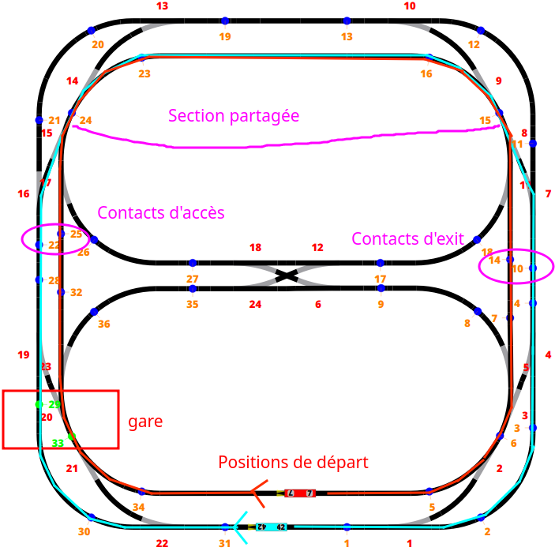

# Labo 4 - Gestion de ressources - PCO

Auteur·ices: Vitória Oliveira et Samuel Roland

## Description des fonctionnalités du logiciel

Ce laboratoire a pour objectif de simuler la gestion de ressources partagées par plusieurs locomotives. Ces ressources comprennent un tronçon commun qui ne peut être emprunté par une locomotive à la fois et une gare où elles doivent s'arrêter après chaque tour, s'attendre puis, après 5 secondes, repartir. 

La priorité d'entrée dans le troncon commun est accordée à la locomotive qui arrive est arrivé en dernier à la gare. 

## Choix d'implémentation
Voici le parcours choisi, nous avons également spécifié les contacts d'accès et d'exit, qui sont les contacts utilisés pour détecter qu'on veut y entrer ou qu'on est est sorti, afin d'appeler `access()` et `leave()` sur `sharedSection`.

<!-- Comment avez-vous abordé le problème, quels choix avez-vous fait, quelle 
décomposition avez-vous choisie, quelles variables ont dû être protégées, ... -->

### Gare

#### Gestion de l'attente
L'attente entre les locomotives est gérée par le mutex `stationWaitMutex` dans la méthode `stopAtStation()` de la classe `sharedSection`. 

Une variable partagée `nbLocoWaiting` compte le nombre de locomotives en attente à la station. 

La locomotive qui arrive en premier incrémente cette variable et attend que le mutex `stationWaitMutex` soit libéré par la locomotive précédante. 
Si une locomotive est déjà présente, la locomotive qui arrive incrémente le nombre de locomotives en attente puis rêlache `stationWaitMutex`. 

Une fois ce mutex libéré, les locomotives attendent 5 secondes puis rédemarrent. 

### Gestion de la priorité
La gestion de la priorité dans ce programme est réalisée à l'aide de la variable `priority` dans la classe `Locomotive`. Chaque locomotive a une priorité attribuée, déterminée par l'ordre dans lequel elles entrent en attente à la gare. La locomotive la plus prioritaire est celle qui a une valeur de 0 pour cet attribut. Plus cette valeur est grande, moins importante est la priorité de la locomotive. (TODO reformuler la phrase précédante)

Lorsqu'une locomotive arrive à la station, elle s'arrête et met à jour sa priorité en fonction du nombre total de locomotives et du nombre de locomotives déjà en attente,  garantissant une priorité plus élevée aux locomotives arrivées en dernier.
Cette instruction est protégée par le mutex `mutex2` afin d'éviter des incohérences dans la lecture de `nbLocoWaiting`. 

(TODO ici ou dans section partagée?)
Lorsqu'une locomotive tente d'accéder à la section critique, elle vérifie si elle a la priorité (priorité égale à 0).
Si elle a la priorité, elle accède directement à la section critique.
Sinon, elle s'arrête, libère l'accès à la section critique et attend que la locomotive prioritaire quitte la section.

### Section partagée

## Tests effectués

<!-- Description de chaque test, et information sur le fait qu'il ait passé ou non -->

Random notes
Important qu'une locomotive gère l'aiguillage pour elle même et pas l'autre.