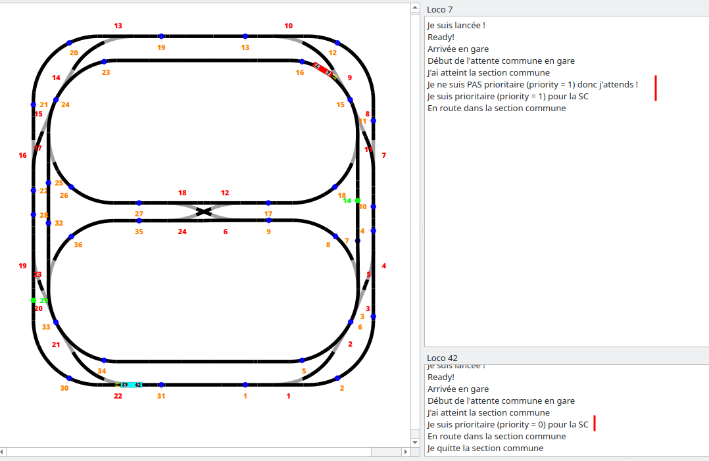
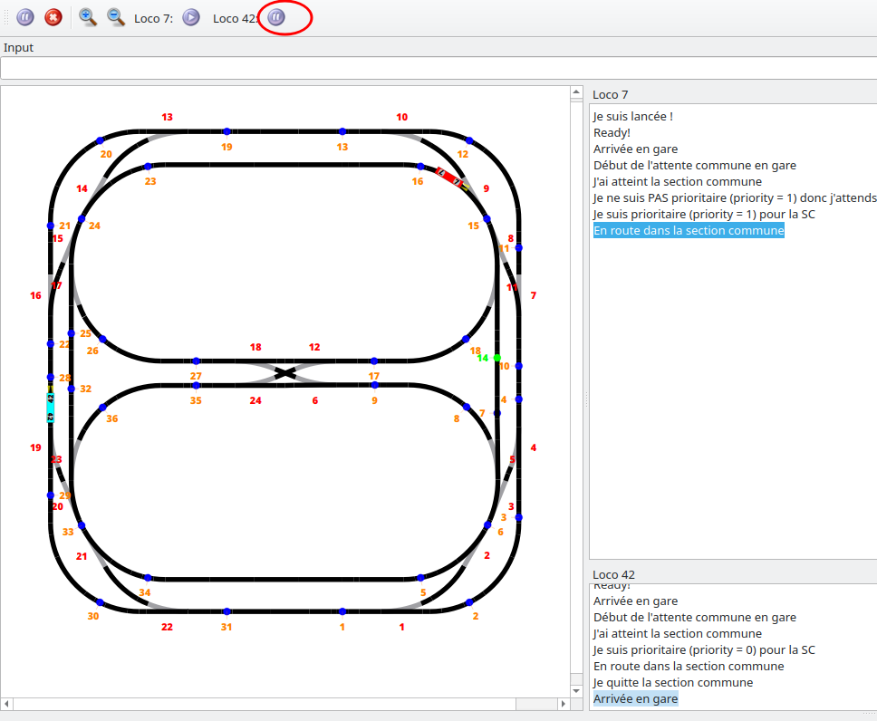
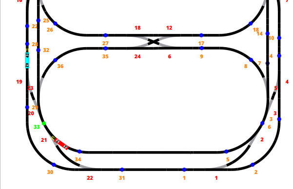
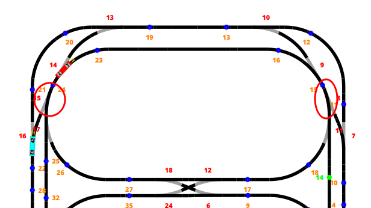

# Labo 4 - Gestion de ressources - PCO

Auteur·ices: Vitória Oliveira et Samuel Roland

## Description des fonctionnalités du logiciel

Ce laboratoire a pour objectif de simuler la gestion de ressources partagées par plusieurs locomotives. Ces ressources comprennent un tronçon commun qui ne peut être emprunté par qu'une locomotive à la fois et une gare où elles doivent s'attendre à chaque tour puis repartir après 5 secondes (temps pour que les passagers changent de train).

La priorité d'entrée dans le troncon commun est accordée à la locomotive qui arrive en dernier à la gare.

Voici le parcours choisi, nous avons également spécifié les contacts d'accès et d'exit, qui sont les contacts utilisés pour détecter qu'on veut y entrer ou qu'on est est sorti, afin d'appeler `access()` (pour demander l'accès) et `leave()` (pour indiquer la sortie) sur `sharedSection`.

## Choix d'implémentation

### Gestion de l'attente en gare
L'attente entre les locomotives est gérée par le mutex `stationWait` initialisé à 0 (car on veut bloquer dès la première locomotive) dans la méthode `sharedSection::stopAtStation()`. Un attribut `nbLocoWaiting` compte le nombre de locomotives en attente à la station.

Toute locomative incrémente `nbLocoWaiting` et **recalcule sa priorité**. On stocke la priorité de chaque locomotive à l'aide de l'attribut `Locomotive::priority`. On la détermine par l'ordre dans lequel elles entrent en attente à la gare. La priorité 0 est la plus prioritaire (dernière locomotive arrivée). L'avant dernière locomotive (la première en gare dans notre cas comme on en a 2) aura une priorité de 1. Le calcul exact est "nombre total de locomotives - nombre de locomotives déjà en attente", garantissant une priorité de valeur plus petite aux locomotives arrivées en dernier. Cette instruction est protégée par le mutex `stationMutex` ainsi que tous les accès en lecture ou écriture à `nbLocoWaiting`. (Cette protection est nécesaire car il peut y avoir 2 locomotives qui arrivent en même temps à la gare).

Pour que toutes **les locomotives s'attendent en gare**, si la locomotive qui arrive n'est pas la dernière, elle acquiert le sémaphore `stationWait`. Sinon on relâche `stationWait` pour chaque autre locomotive (forcèment en attente) (`TOTAL_NB_LOCOS` - 1 release à faire), grâce à un compteur `TOTAL_NB_LOCOS` constant défini à 2 pour notre cas.

Ensuite les locomotives attendent chacune 5 secondes, décrémente `nbLocoWaiting` (en section protégée par `stationMutex`)  puis rédémarrent.

### Gestion de l'accès au tronçon commun
L'accès au tronçon commun est accordé à la seul locomotive qui a la plus haute priorité (`loco.priority == nbLocoLeavedCS`) et quand l'accès est libre. Les autres locomotives doivent attendre (arrêtant le moteur et en bloquant sur le sémaphore `CSAccess`). Comme plusieurs locomotives veulent faire un `access()` au même moment voir attendent ensemble, nous protégeons `nbLocoLeavedCS` et `CSFree` avec le mutex `CSMutex`. Une fois l'accès accordé, il suffit juste de redémarrer le moteur pour y passer.

Quand la locomotive prioritaire quitte le tronçon commun, en appelant `leave()` elle va incrémenter `nbLocoLeavedCS`, calculer le nombre de locos en attente pour y relâcher le sémaphore `CSAccess` autant de fois. Il est important de noter que nous ne pouvons pas simplement effectuer une seule libération (release()) car, avec trois locomotives, par exemple, deux locomotives pourraient être en attente, et la priorité attribuée ne serait pas nécessairement respectée. Cela entraînerait l'acquisition du sémaphore CSAccess dans l'ordre FIFO, plutôt que dans l'ordre de priorité de chaque locomotive. Par conséquent, nous sommes contraints de libérer toutes les locomotives en attente, permettant ainsi une réévaluation de leur priorité respective.

 

### Evolutivité

En termes d'évolutivité, nous avons conçu le système de manière à ce que l'ajout de locomotives supplémentaires, avec un nombre équivalent de voies parallèles et un système d'attente en gare similaire, ne nécessite que des modifications minimes dans le fichier `cppmain.cpp` pour créer la locomotive et son comportement associé (`locomotivebehavior`). De plus, il suffirait d'incrémenter la constante `TOTAL_NB_LOCOS` dans le fichier synchro.h.

Pour ne pas avoir de code spécifique à nos 2 locomotives actuelles (7 et 42), nous avons rajouté 3 paramètres dans le constructeur de `locomotivebehavior`:
1. `std::pair<int, int> delimitorsCS`: une pair de délimiteur début-fin pour la SC pour la loco en question
1. `const int station`: le point de contact de la station
1. `std::map<int, int> aiguillagesChanges`: la liste des changements à faire sur l'aiguillages au moment de rentrer en SC

## Tests effectués
Nous avons executé notre programme en gardant l'inertie et laissé quelques tours pour vérifier que toutes les contraintes étaient fonctionnelles.

D'abord on voit que la priorité et l'attente sont respecté, la loco 7 attend bien avant l'entrée de la SC et part dès que la loco 42 a quitté la SC.

Dans ce cas, nous avons testé que l'attente en gare se fait correctement (loco 42) et le compteur de 5s n'a pas encore démarré, en mettant en pause la loco 7.

 
 
 
 
 
 
 
 
 
 
 
 
 
 
 
 

Nous voyons ici que la loco 42 arrivant après, est bien laissée prioritaire pour la SC.

On voit également que les aiguillages 15 et 8 ont bien été switchés pour cette loco.

